# 📑 SPLITZY — Complete Project Documentation & Viva Presentation Guide

---

## 📌 Table of Contents
1. [Executive Project Summary](#1-executive-project-summary)
2. [Problem Statement & Motivation](#2-problem-statement--motivation)
3. [Key Features & System Capabilities](#3-key-features--system-capabilities)
4. [Mathematical Formulation & Core Algorithm](#4-mathematical-formulation--core-algorithm)
5. [System Architecture & Tech Stack](#5-system-architecture--tech-stack)
6. [Source Code & File Organization](#6-source-code--file-organization)
7. [Step-by-Step Live Demo & Presentation Script](#7-step-by-step-live-demo--presentation-script)
8. [Teacher & Viva Questions with Answers (Q&A)](#8-teacher--viva-questions-with-answers-qa)
9. [Future Enhancements & Scope](#9-future-enhancements--scope)
10. [Quick Setup & Local Execution](#10-quick-setup--local-execution)

---

## 1. 🌟 Executive Project Summary

**Splitzy** is a modern, responsive, client-side Progressive Web Application (PWA) designed to simplify group expenses, calculate net balances, and minimize cross-party debt settlements. 

Traditional bill splitters calculate pairwise debts, resulting in an unmanageable $O(N^2)$ web of transactions. Splitzy solves this by implementing an optimal **Greedy Min-Cash-Flow Debt Simplification Algorithm** that mathematically reduces the total number of transactions to at most **$(N - 1)$**.

The application features:
* **Dynamic 4-Mode Split Engine**: Equal, Exact amounts, Percentage shares, and Itemized ("Who Ate What") splits.
* **Persona Switcher ("Viewing As")**: Dynamic context re-calculation from any group member's perspective.
* **Instant UPI Payments**: Integrated NPCI-compliant Unified Payments Interface (UPI) deep-links and dynamic QR code generation.
* **Interactive Visual Analytics**: Category spending distributions and member contribution charts using Chart.js.
* **Export & Sharing Hub**: Instant WhatsApp summaries, downloadable CSV logs, and printable invoices.
* **Offline-First PWA**: Offline capability via Service Worker precaching and zero-latency browser `localStorage` persistence.

---

## 2. 💡 Problem Statement & Motivation

### The Real-World Problem:
When friends travel together, roommates split monthly household bills, or colleagues dine out, multiple individuals pay for different items at different times. 
* Who paid for cabs? 
* Who paid for groceries? 
* Who owes whom, and how much?

Attempting to settle one-on-one leads to:
1. **Redundant Transactions**: A owes B ₹500, B owes C ₹500, C owes A ₹500. Instead of 0 transactions, 3 separate payments occur.
2. **Calculation Errors**: Unequal splits and manual math frequently result in discrepancies.
3. **Payment Friction**: Chasing bank details and payment handles manually is awkward and inefficient.

### The Splitzy Solution:
Splitzy acts as an automated settlement engine. It tracks all expenses, aggregates per-person credits and debits into a single net balance, and computes the shortest path of direct settlements with integrated UPI payment links.

---

## 3. 🚀 Key Features & System Capabilities

```mermaid
graph TD
    A[Splitzy Web App] --> B[Group Management]
    A --> C[Split Calculation Engine]
    A --> D[Debt Simplification & UPI]
    A --> E[Analytics & Visualization]
    A --> F[Sharing & Data Persistence]

    B --> B1[Group Types & Categories]
    B --> B2[Shareable 6-char Join Codes]
    B --> B3[Active Persona Switcher]

    C --> C1[Equal Split]
    C --> C2[Exact Split]
    C --> C3[Percentage Split]
    C --> C4[Itemized 'Who Ate What']

    D --> D1[Min-Cash-Flow Algorithm]
    D --> D2[Dynamic UPI QR Code via QRious]
    D --> D3[1-Click Settle Up with Confetti]

    E --> E1[Category Doughnut Chart]
    E --> E2[Paid vs Consumed Bar Chart]
    E --> E3[Top Spender & Average Spend KPI]

    F --> F1[WhatsApp Formatted Text]
    F --> F2[CSV Spreadsheet Download]
    F --> F3[Printable Invoices]
    F --> F4[LocalStorage & PWA Offline Cache]
```



### 1. Group & Member Management
* **Categorized Groups**: Organize activities with tailored icons (🏖️ Trips, 🏠 Flatmates, 🍕 Dining, 🚗 Travel, 🚀 Projects).
* **Shareable Join Codes**: Generates 6-character clean codes (e.g. `GRP-9B2X`) and direct URL query invite links (`?join=GRP-XXXX`).
* **Persona Switcher**: Seamlessly switch the active user profile to observe personalized financial metrics (*"You are owed ₹X"* vs *"You owe ₹Y"*).

### 2. Dynamic 4-Mode Split Engine
* **Equal Split**: Evenly divides total expense across chosen members ($\frac{\text{Amount}}{\text{Count}}$).
* **Exact Split**: Allows assigning exact rupee amounts per person with real-time balance validation against the total amount.
* **Percentage Split**: Allocates percentage shares per member with strict 100% total validation.
* **Itemized ("Who Ate What") Split**: Dish-by-dish or line-item breakdown with custom diner allocation.

### 3. Smart Settlement & UPI Payment Flow
* **Greedy Settlement**: Consolidates complex multi-party balances into minimal direct payments.
* **NPCI-Compliant UPI Integration**: Validates UPI Virtual Payment Addresses (VPAs) against standard bank handle regex and generates `upi://pay` deep-links.
* **Dynamic QR Code Generation**: Uses `QRious` to render scannable payment QR codes for any UPI app (GPay, PhonePe, Paytm, BHIM).
* **Settlement Logging**: Records partial and full payments with celebratory micro-interactions (confetti animation).

### 4. Interactive Financial Visualizations (Chart.js)
* **Category Breakdown Chart**: Visual doughnut chart depicting distribution across Food, Travel, Accommodation, Utilities, Shopping, Entertainment, etc.
* **Member Contribution Bar Chart**: Side-by-side comparison of total amount paid out-of-pocket versus total share consumed per member.
* **Group KPI Cards**: Highlights Total Spend, Group Average Spend, and Top Contributor.

### 5. Multi-Channel Export Hub
* **WhatsApp Formatted Summary**: Formats group summary with markdown bolding, bullet points, and settlement directions ready for instant copy-pasting.
* **CSV Log Export**: Generates a standard RFC-4180 compliant CSV file for Excel/Google Sheets.
* **Print Invoices**: Formatted CSS `@media print` layout for statement printing and PDF saving.

### 6. PWA & Offline Support
* **Service Worker (`sw.js`)**: Caches essential HTML, CSS, JavaScript, and fonts for full offline operation.
* **Web Manifest (`manifest.json`)**: Enables native "Install App" prompt on Android, iOS, and desktop browsers.

---

## 4. 🧮 Mathematical Formulation & Core Algorithm

### The Mathematical Problem
In a group of $N$ individuals who share multiple expenses, pairwise one-to-one settlements create up to:
$$\frac{N(N - 1)}{2} = O(N^2) \text{ transactions}$$

### The Solution: Min-Cash-Flow Greedy Algorithm

#### Step 1: Net Balance Computation
For each member $i$ in group members $M$:
$$\text{Net}(i) = \sum \text{Amount Paid by } i - \sum \text{Share Consumed by } i$$

* If $\text{Net}(i) > 0 \implies$ Member is a **Creditor** (should receive money).
* If $\text{Net}(i) < 0 \implies$ Member is a **Debtor** (owes money).
* If $\text{Net}(i) = 0 \implies$ Member is **Settled**.

$$\sum_{i=1}^{N} \text{Net}(i) = 0 \quad (\text{Conservation of Money})$$

#### Step 2: Greedy Matching & Debt Reduction
1. Separate members into two priority lists:
   * $\text{Debtors} = \{ (u, |\text{Net}(u)|) \mid \text{Net}(u) < 0 \}$
   * $\text{Creditors} = \{ (v, \text{Net}(v)) \mid \text{Net}(v) > 0 \}$
2. Sort Debtors descending by amount owed.
3. Sort Creditors descending by amount receivable.
4. Pick the maximum debtor $D$ and maximum creditor $C$.
5. Determine transfer amount:
   $$T = \min(D_{\text{amount}}, C_{\text{amount}})$$
6. Record transaction: **$D \rightarrow C$ of amount $T$**.
7. Adjust remaining balances:
   $$D_{\text{amount}} \leftarrow D_{\text{amount}} - T$$
   $$C_{\text{amount}} \leftarrow C_{\text{amount}} - T$$
8. Remove any party whose remaining balance reaches $0$.
9. Repeat until both lists are empty.

#### Complexity & Guarantee
* **Max Transactions**: At most **$(N - 1)$** transactions.
* **Time Complexity**: $O(E + N \log N)$, where $E$ is the number of expenses and $N$ is the number of members.
* **Space Complexity**: $O(N)$ for balance maps and priority queues.

---

## 5. 💻 System Architecture & Tech Stack

| Layer | Technology | Key Responsibility |
| :--- | :--- | :--- |
| **Structure** | **HTML5** | Semantic layout, tab routing containers, accessible modal dialogs |
| **Styling & Theme** | **CSS3 + Bootstrap 5** | Design tokens, Glassmorphism, CSS variables, Dark/Light modes, Responsive grid |
| **Logic & Algorithms**| **JavaScript (ES6+)** | Object-Oriented modular architecture, Min-Cash-Flow engine, DOM events |
| **Visualizations** | **Chart.js (v4.x)** | High-contrast category doughnut & member contribution bar charts |
| **QR Code Engine** | **QRious.js** | Client-side dynamic vector-to-canvas UPI QR code rendering |
| **Celebrations** | **Canvas-Confetti** | Lightweight canvas particle animation on debt settlements |
| **Persistence** | **LocalStorage API** | Structured JSON storage, data schema migrations, backup import/export |
| **PWA & Offline** | **Service Worker** | Cache-first asset caching, offline capability, standalone web manifest |

---

## 6. 📁 Source Code & File Organization

```text
SPLITZY/
├── index.html              # Main Single Page Application shell, navigation & modals
├── manifest.json           # PWA metadata, color theme, and icon definitions
├── sw.js                   # Service Worker script managing asset caching & offline mode
├── README.md               # Project overview & brief summary
├── PROJECT_DOCUMENTATION.md# Exhaustive documentation & teacher presentation guide
├── assets/
│   └── favicon.svg         # Splitzy branding vector SVG logo
├── css/
│   └── style.css           # Glassmorphism effects, design tokens, light/dark themes
└── js/
    ├── storage.js          # LocalStorage CRUD, seed data, UPI validation, event bus
    ├── settlement.js       # Min-Cash-Flow algorithm & UPI URI/QR generation logic
    ├── groups.js           # Group management, member chip renderers, invite link logic
    ├── expenses.js         # Split logic (Equal, Exact, %, Itemized) & expense renderers
    ├── analytics.js        # Chart.js instances and group financial KPI cards
    ├── export.js           # CSV file download, WhatsApp text formatter, print styles
    └── app.js              # Application controller, modal bindings, view routing
```

---

## 7. 🎬 Step-by-Step Live Demo & Presentation Script

Use this structured sequence when demonstrating the app to your evaluator:

```text
1. Introduction & Overview (1 minute)
   - Open index.html in the browser.
   - Mention that Splitzy is a client-side Progressive Web App (PWA) with offline capabilities.
   - Toggle Dark/Light Mode to showcase responsive design and CSS variable theming.

2. Persona Switcher ("Viewing As") (1 minute)
   - Highlight the "Viewing As" persona switcher dropdown in the header.
   - Switch between members (e.g. "Manjiri" -> "Rahul").
   - Show how the top summary cards ("You Owe" vs "You are Owed") update dynamically.

3. Expense Entry & Dynamic Split Modes (2 minutes)
   - Open a group (e.g., "Goa Trip 🏖️").
   - Click "+ Add Expense".
   - Demonstrate:
     * Equal Split: Auto-calculated per-person preview.
     * Exact Split: Enter custom values with real-time balance remaining check.
     * Percentage Split: Validate that shares sum exactly to 100%.

4. Debt Simplification & UPI Payment Demo (2 minutes)
   - Navigate to the "Settlement" tab.
   - Explain the Greedy Min-Cash-Flow Algorithm: how multiple expenses collapse into direct transfers.
   - Click "Pay / Settle Up" on a debt.
   - Show the dynamic UPI QR Code and deep-link generated for mobile UPI apps.
   - Click "Mark as Settled" -> show confetti micro-interaction and instant balance recalculation.

5. Visual Analytics & Multi-Format Export (1 minute)
   - Open the "Analytics" tab.
   - Point out the Category Doughnut Chart and Member Paid vs Consumed Bar Chart.
   - Click "Share WhatsApp" -> show formatted markdown summary ready for chat groups.
   - Click "Export CSV" -> show instant spreadsheet download.
```

---

## 8. 🎓 Teacher & Viva Questions with Answers (Q&A)

### Q1. Why use the Min-Cash-Flow algorithm instead of direct pairwise settlements?
> **Answer**: In a group of $N$ people, direct pairwise settling requires up to $\frac{N(N-1)}{2} = O(N^2)$ separate transactions. The Min-Cash-Flow greedy algorithm computes net positions ($\text{Total Paid} - \text{Total Share}$) and matches maximum debtors with maximum creditors. This guarantees that all debts are settled in at most **$(N - 1)$** direct transactions.

### Q2. How is data persisted without a dedicated backend database?
> **Answer**: Splitzy utilizes the browser's `localStorage` API with structured JSON serialization. To keep the UI reactive across modules without a full framework, Splitzy implements custom DOM event emitters (e.g., `splitzy:user-updated`, `splitzy:group-updated`). It also provides one-click JSON backup export and restore.

### Q3. How does the UPI payment feature work, and is it secure?
> **Answer**: Splitzy constructs official NPCI-compliant `upi://pay` deep-link URIs containing the receiver's Virtual Payment Address (VPA), sanitized payee name, transaction amount, note, and unique reference ID (`SPLITZY_timestamp`). The `QRious` library converts this URI into a high-resolution QR code. All user input is sanitized with strict regex validation to prevent URI parameter injection.

### Q4. What makes this application a Progressive Web App (PWA)?
> **Answer**: Splitzy provides:
> 1. A Web App Manifest (`manifest.json`) specifying application name, icons, standalone display mode, and theme colors.
> 2. A Service Worker (`sw.js`) implementing a cache-first strategy for core assets (HTML, CSS, JS, external fonts), allowing the app to install on home screens and function completely offline.

### Q5. What is the time complexity of adding an expense and simplifying debts?
> **Answer**: 
> * **Adding an Expense**: $O(K)$, where $K$ is the number of members sharing the bill.
> * **Calculating Group Balances**: $O(E \cdot K)$, where $E$ is the total number of expenses.
> * **Debt Simplification Loop**: $O(N \log N)$ where $N$ is the number of group members, due to sorting debtors and creditors in each step.

---

## 9. 🚀 Future Enhancements & Scope

1. **Real-Time Cloud Synchronization**: Integrating Firebase Firestore or Supabase for multi-device live sync.
2. **AI Receipt Scanner (OCR)**: Parsing uploaded receipt photos using Gemini Vision API or Tesseract.js to auto-populate itemized splits.
3. **Multi-Currency & Live Forex**: Automatic currency conversion for international trips.
4. **Push Notifications**: Web push reminders for pending settlements.

---

## 10. 🛠️ Quick Setup & Local Execution

Splitzy requires no build steps or heavy node modules. You can run it instantly:

1. **Direct Browser Execution**:
   * Double-click [index.html](file:///d:/projects2/SPLITZY/index.html) in any modern browser.

2. **Via Local Development Server**:
   ```bash
   # Using Python 3
   python -m http.server 8000

   # Or using Node.js npx serve
   npx serve .
   ```
   Open `http://localhost:8000` in your web browser.
